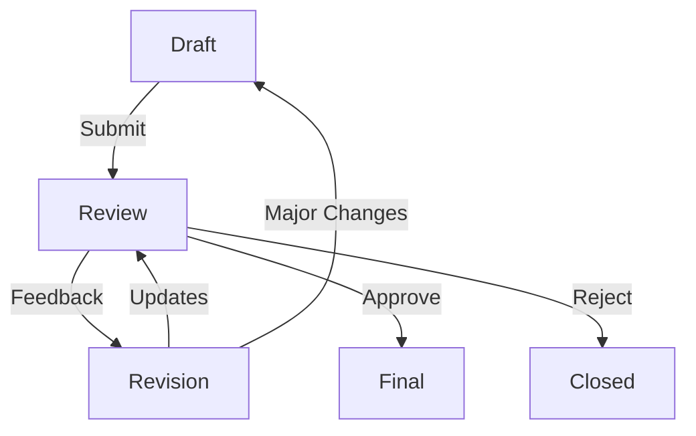

# KentNabız (UrbanPulse) – RFC (Request for Comments) Dokümanı

## RFC Süreci

### 1. Genel Bakış

#### 1.1. Amaç
Bu doküman, KentNabız projesinde yeni özellikler, teknik değişiklikler ve tasarım kararları için standart bir tartışma ve onay süreci tanımlar.

#### 1.2. Hedefler
- Şeffaf ve katılımcı bir karar alma süreci oluşturmak
- Teknik değişikliklerin etkilerini kapsamlı şekilde değerlendirmek
- Paydaş geri bildirimlerini sistematik olarak toplamak ve değerlendirmek
- Projenin teknik vizyonunu korumak ve geliştirmek

### 2. RFC Yaşam Döngüsü

#### 2.1. Aşamalar

1. **Taslak (Draft)**
   - RFC önerisi hazırlanır
   - Temel teknik detaylar ve gerekçeler belirtilir
   - İlk geri bildirimler için paylaşılır

2. **İnceleme (Review)**
   - Paydaşlar tarafından incelenir
   - Teknik tartışmalar yürütülür
   - Değişiklik önerileri alınır

3. **Revizyon (Revision)**
   - Geri bildirimler doğrultusunda güncellenir
   - Teknik detaylar netleştirilir
   - Uygulama planı oluşturulur

4. **Final**
   - Son onay için sunulur
   - Kabul veya ret kararı verilir
   - Uygulama süreci başlatılır

### 3. RFC Şablonu

#### 3.1. Metadata
```yaml
RFC Numarası: RFC-001
Başlık: [Özellik/Değişiklik Adı]
Yazar: [İsim]
Durum: [Taslak/İnceleme/Revizyon/Final]
Oluşturma Tarihi: YYYY-MM-DD
Son Güncelleme: YYYY-MM-DD
İlgili Bileşenler: [Backend/Frontend/Mobile/Database vs.]
```

#### 3.2. İçerik Bölümleri

1. **Özet**
   - Önerilen değişikliğin kısa açıklaması
   - Temel motivasyon ve hedefler
   - Beklenen faydalar

2. **Mevcut Durum**
   - Mevcut sistemin ilgili bölümlerinin açıklaması
   - Var olan kısıtlamalar veya problemler
   - İyileştirme gereken alanlar

3. **Önerilen Çözüm**
   - Detaylı teknik tasarım
   - Mimari değişiklikler
   - API değişiklikleri
   - Veritabanı şema değişiklikleri
   - Kullanıcı arayüzü değişiklikleri

4. **Alternatifler**
   - Değerlendirilen diğer çözümler
   - Neden tercih edilmedikleri
   - Trade-off analizi

5. **Uygulama Planı**
   - Aşamalı uygulama stratejisi
   - Gerekli kaynaklar
   - Zaman çizelgesi
   - Test stratejisi

6. **Geriye Dönük Uyumluluk**
   - Breaking changes
   - Migrasyon stratejisi
   - Geçiş süreci

### 4. Örnek RFC: Gerçek Zamanlı Bildirim Sistemi

```yaml
RFC Numarası: RFC-001
Başlık: Gerçek Zamanlı Bildirim Sistemi Entegrasyonu
Yazar: Ali Yılmaz
Durum: Taslak
Oluşturma Tarihi: 2024-01-20
Son Güncelleme: 2024-01-20
İlgili Bileşenler: Backend, Frontend, Mobile
```

#### 4.1. Özet
KentNabız platformuna gerçek zamanlı bildirim sisteminin entegre edilmesi önerilmektedir. Bu sistem, kullanıcıların raporladıkları sorunların durumundaki değişiklikleri, yeni yorumları ve yakın çevrelerindeki yeni raporları anında alabilmelerini sağlayacaktır.

#### 4.2. Mevcut Durum
- Bildirimler sadece e-posta yoluyla gönderiliyor
- Kullanıcılar güncellemeleri görmek için uygulamayı manuel kontrol etmek zorunda
- Yerel yönetim personeli acil durumlardan gecikmeli haberdar oluyor

#### 4.3. Önerilen Çözüm

##### Teknik Tasarım
```typescript
interface Notification {
  id: string;
  userId: string;
  type: NotificationType;
  title: string;
  message: string;
  data: {
    reportId?: string;
    commentId?: string;
    status?: string;
  };
  read: boolean;
  createdAt: Date;
}

enum NotificationType {
  REPORT_STATUS_CHANGE = 'REPORT_STATUS_CHANGE',
  NEW_COMMENT = 'NEW_COMMENT',
  NEARBY_REPORT = 'NEARBY_REPORT',
  ASSIGNMENT = 'ASSIGNMENT'
}
```

##### Altyapı Değişiklikleri
1. WebSocket Sunucu (Socket.io)
   - Gerçek zamanlı bağlantı yönetimi
   - Oda (room) bazlı bildirim dağıtımı
   - Bağlantı durumu izleme

2. Push Notification Servisi
   - Firebase Cloud Messaging entegrasyonu
   - iOS ve Android için native push desteği
   - Web push notifications

3. Bildirim Tercihleri
   - Kullanıcı bazlı bildirim ayarları
   - Kategori bazlı filtreleme
   - Coğrafi alan bazlı filtreleme

#### 4.4. Uygulama Planı

1. Faz 1: Altyapı (2 hafta)
   - WebSocket sunucu kurulumu
   - Veritabanı şema güncellemeleri
   - Test ortamı hazırlığı

2. Faz 2: Backend Implementasyon (3 hafta)
   - Bildirim servisi geliştirme
   - WebSocket endpoint'leri
   - Push notification entegrasyonu

3. Faz 3: Frontend/Mobile Implementasyon (3 hafta)
   - Bildirim UI bileşenleri
   - WebSocket client entegrasyonu
   - Push notification handling

4. Faz 4: Test ve Optimizasyon (2 hafta)
   - Yük testleri
   - Bağlantı dayanıklılığı testleri
   - Battery impact analizi

### 5. RFC Değerlendirme Kriterleri

#### 5.1. Teknik Kriterler
- Mevcut mimari ile uyumluluk
- Ölçeklenebilirlik
- Performans etkileri
- Güvenlik değerlendirmesi
- Test edilebilirlik

#### 5.2. İş Kriterleri
- Kullanıcı deneyimi etkisi
- Kaynak gereksinimleri
- Zaman çizelgesi
- Maliyet/fayda analizi

### 6. Geri Bildirim ve Tartışma Süreci

#### 6.1. Geri Bildirim Kanalları
1. GitHub Issues
   - RFC için özel issue açılır
   - İlgili etiketler kullanılır
   - Tartışmalar thread'ler halinde yürütülür

2. Technical Review Meetings
   - Haftalık teknik değerlendirme toplantıları
   - Paydaşların katılımı
   - Kararların dokümantasyonu

#### 6.2. Karar Verme Süreci
1. Teknik Komite
   - Lead Developer
   - Sistem Mimarı
   - UX Tasarımcısı
   - DevOps Uzmanı

2. Değerlendirme Metrikleri
   - Technical Feasibility Score (1-5)
   - Impact Score (1-5)
   - Risk Score (1-5)
   - Resource Requirement Score (1-5)

3. Final Onay
   - Minimum 2 teknik komite üyesinin onayı
   - Impact Score > 3 olan değişiklikler için proje yöneticisi onayı
   - Risk Score > 4 olan değişiklikler için güvenlik değerlendirmesi

### 7. RFC Yaşam Döngüsü Durumları



### 8. RFC Arşivi ve Dokümantasyon

#### 8.1. Arşiv Yapısı
```
/rfcs
  ├── active/
  │   ├── RFC-001-realtime-notifications.md
  │   └── RFC-002-offline-support.md
  ├── completed/
  │   └── RFC-000-template.md
  └── rejected/
```

#### 8.2. Versiyon Kontrolü
- Her RFC için ayrı git branch'i
- Pull request bazlı review süreci
- Merge commits ile değişiklik geçmişi

Bu RFC dokümanı, KentNabız projesinin gelişim sürecinde önerilecek değişikliklerin ve yeni özelliklerin sistematik bir şekilde değerlendirilmesi, tartışılması ve karara bağlanması için standart bir çerçeve sunmaktadır.